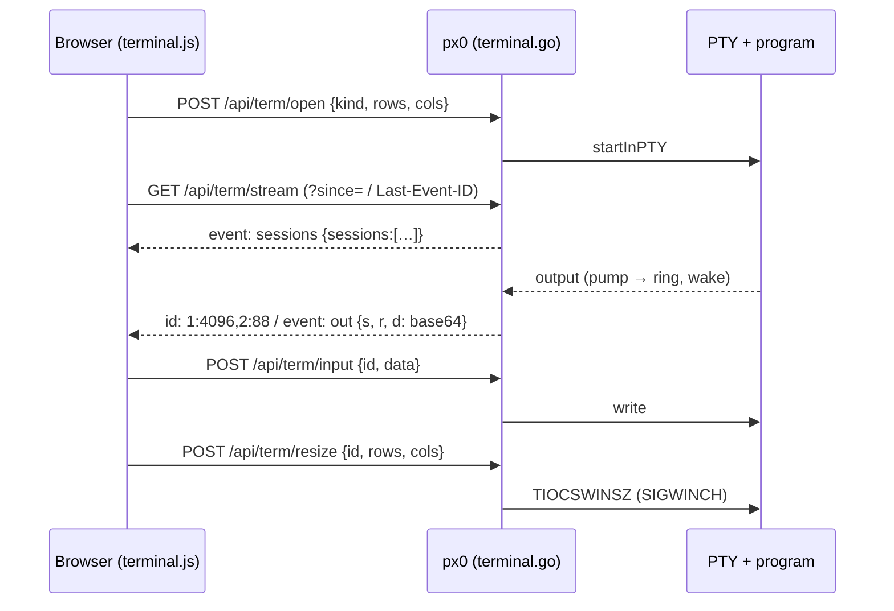

# Integrated Terminal & Harness Sessions

This document describes the terminal pane: interactive pseudo-terminals hosted by the px0 process and drawn in the browser, running a shell (a **Shell Session**) or the selected coding harness (a **Harness Session**) in the workspace.

- sessions, access control and transport: [`terminal.go`](../../terminal.go)
- pseudo-terminals: [`pty_unix.go`](../../pty_unix.go), [`pty_linux.go`](../../pty_linux.go), [`pty_darwin.go`](../../pty_darwin.go), [`pty_other.go`](../../pty_other.go)
- the harness's interactive command: `agentManager.SessionCommand` in [`agent.go`](../../agent.go)
- the pane, stream client and Alt+E handoff: [`web/src/terminal.js`](../../web/src/terminal.js)
- the renderer: xterm.js 6.0.0 and its fit addon, vendored under [`web/vendor/xterm/`](../../web/vendor/xterm/)

## 1. Why It Exists

Headless Dispatch (Alt+E's inline composer, [Harness Editing](agent-editing.md)) starts a fresh, non-interactive harness run for every instruction. The harness keeps no conversation between runs, cannot ask a clarifying question, and prints to the terminal px0 was launched from. Running the harness in a separate terminal next to px0 (the Sidecar setup) keeps the conversation, but every handoff means switching windows and copying `path:line` references by hand. In PR review, the checkout sits in a random temporary directory the user never sees.

A Harness Session keeps the conversation inside px0. With one running, Alt+E pastes the selection's Reference into it and hands it the keyboard. The session starts in the workspace, which in PR review is the PR checkout.

## 2. Tenets

- **px0 still authors nothing.** No endpoint accepts file content. `/api/term/input` carries keystrokes the user typed. The only bytes px0 sends unprompted are a pasted Reference (`path:L1-L2 `), and it never presses Enter: the user submits it.
- **Single binary, no CGO, no new Go dependency.** Pseudo-terminals are opened with raw `syscall` ioctls, following the existing `tty_*.go` files. The renderer is a static asset embedded like every other file under `web/`.
- **Stateless on disk.** Sessions and their scrollback live in memory, belong to the px0 process, and end with it, like a PR checkout.
- **Hot paths untouched.** Nothing is loaded or started until the pane is used. xterm.js is fetched the first time the pane opens, not bundled into `app.js`.

## 3. Pseudo-Terminals Without CGO

`startInPTY(cmd, rows, cols)` opens `/dev/ptmx`, finds the slave, sizes it (`TIOCSWINSZ`), and starts the child with `Setsid` + `Setctty` so it leads a new session whose controlling terminal is the slave:

| OS | Allocate | Unlock | Slave name |
| --- | --- | --- | --- |
| Linux | `open /dev/ptmx` | `TIOCSPTLCK` | `TIOCGPTN` gives `/dev/pts/N` |
| macOS | `open /dev/ptmx`, `TIOCPTYGRANT` | `TIOCPTYUNLK` | `TIOCPTYGNAME` |

Other platforms build `pty_other.go`, and the pane reports the terminal as unsupported there. Windows needs ConPTY, and the BSDs have their own ptmx ioctls.

Two details matter:

- **ioctls go through `SyscallConn().Control`, never `File.Fd()`.** `Fd()` switches the descriptor to blocking mode, and then `Close` no longer interrupts a pending `Read`, so a closed session would leak its reader goroutine. `TestPTYCloseUnblocksRead` guards this.
- **The child's process group is its pid** (`Setsid`), so `signalGroup(pid, …)` reaches the shell and whatever it runs in the foreground.

## 4. Sessions

`termManager` owns up to `termMaxSessions` (4) sessions. Each has:

- a **ring buffer** of the last `termRingBytes` (256 KB) of output, addressed by a running byte offset `end`, so the ring always covers `[end - 256 KB, end)`;
- a **pump** goroutine copying PTY output into the ring and waking every stream;
- a **reap** goroutine waiting on the leader, so it never lingers as a zombie, and recording its exit code.

A session whose program exits stays listed (struck through, with its exit code) until the user closes it, so its last output can still be read.

**Closing** a session closes the PTY master, which hangs up the terminal the way closing a terminal window does, and sends `SIGHUP` to the group. After `termHangupGrace` (2 s), anything still running gets `SIGKILL`. A leader that has already been reaped is never signalled: its pid may belong to another process by then.

**On exit** (`Ctrl+C` on px0), `main` calls `termManager.Close` right after the server stops and before `prSession.Close` removes a PR checkout the sessions may be running in. It hangs up every session, waits up to 500 ms, then kills what is left.

**Edits reach open tabs** through the git watcher. When a session's output pauses for 400 ms, which is usually a harness finishing a step, `onQuiet` triggers an immediate status check instead of waiting for the next adaptive poll. It does not fire on every chunk, because a spinner alone would run `git status` several times a second. A second edit to a file that is already modified is detected by the size and mtime stamps described in [Git Integration](git-integration.md).

## 5. Transport: One Multiplexed SSE Stream

- **One stream for every session.** Browsers allow six HTTP/1.1 connections per origin, and `/api/stream` already holds one. A stream per session would starve ordinary API calls.
- **Frames carry cursors.** Each `out` frame's SSE id is `sessionID:offset,…` as of that frame, so a browser that drops mid-batch resumes exactly after the last frame it received. EventSource sends the id back as `Last-Event-ID` when it reconnects by itself. `terminal.js` passes it as `?since=` when it reopens the stream after the page was hidden.
- **Reset instead of backpressure.** A session the browser has not seen, or a cursor that fell out of the ring, gets a frame marked `r` (clear the screen), followed by the ring's contents. The stream handler copies bytes under the lock and writes them after releasing it, so a slow browser never blocks the PTY reader.
- **Base64 payloads.** PTY output is raw bytes and may split a UTF-8 sequence across reads.
- **No WebSocket.** It would need a new dependency or a hand-written RFC 6455 implementation, and proxies under `-base-path` need upgrade configuration. SSE plus POST works wherever `/api/stream` already does. Input POSTs are serialized in the browser, one request in flight with keystrokes coalesced, so ordering is preserved.

## 6. Access Control

A shell is a stronger capability than a harness run, so the terminal has its own gate on top of the Origin check used by `localPost`:

1. **Loopback only.** When px0 listens on anything other than loopback (`-host 0.0.0.0`, the Docker image), the terminal is created unavailable, and `/api/meta` explains why. Each request's `Host` must also be `localhost` or a loopback IP (`isLoopbackHost`), which is stricter than `localPost`'s "any IP address".
2. **A per-process token.** px0 generates 32 random bytes at startup and adds `?t=<token>` to the URL it opens and prints. `handleIndex` exchanges a matching token for a cookie (`HttpOnly; SameSite=Strict`, path = the base path, named `px0_term_<port>` because cookies ignore ports), then redirects so the token leaves the address bar. Every `/api/term/*` request needs the cookie, compared in constant time. This keeps out other local processes and users, which can set an `Origin` header to anything.
3. **Same-origin POSTs.** Mutations also require the `Origin` to match the `Host`.

A page opened without the token (a bookmark, say) works as usual, but its pane explains that the terminal needs the printed URL.

## 7. The Pane

`terminal.js` is a view over server state. A reloaded page, or a second tab, lists the running sessions from `/api/meta` and replays their scrollback from the stream.

- **Keys.** The global shortcut handler in `shortcuts.js` ignores keys typed into the pane (`Ctrl+W`, `Ctrl+D`, `Escape`…), which belong to the program. Only `Cmd` shortcuts on a Mac, which a terminal never uses, still reach px0. ``Ctrl+` `` toggles the pane from anywhere, in the capture phase before xterm sees it. On Linux and Windows, `Ctrl+Shift+C/V` copy and paste.
- **Alt+E handoff.** `selbar.js` asks the registered handoff handler first. It targets the most recently focused Harness Session that is still running (Shell Sessions are never targeted) and uses xterm's `paste()`, which applies bracketed paste when the program has enabled it. It returns false when there is no such session, and the inline composer opens as before.
- **Theme.** The ANSI palette is mapped from the theme's syntax and diff tokens and updates when the theme changes.
- **Harness command.** `SessionCommand` runs the harness's plain interactive form: the binary with its model flag (`claude --model sonnet`, `codex -m …`), `aider --no-auto-commits`, or `goose session` with `GOOSE_MODEL`. It leaves out the unattended-approval flags Headless Dispatch needs, because a person is at the keyboard. A custom `-agent` command template has no interactive form; only shells are offered with it. The interactive forms of `claude` and `codex` were checked against their CLIs; the others reuse each preset's model flag.

## 8. Endpoints

| Endpoint | Method | Purpose |
| --- | --- | --- |
| `/api/term/stream` | `GET` | SSE: `sessions` lists, and `out` frames `{s, r, d}` with cursor ids |
| `/api/term/open` | `POST` | `{kind: "shell" \| "harness", rows, cols}` → `{id, title, kind}`; `409` at the cap or when the harness cannot start |
| `/api/term/input` | `POST` | `{id, data, bin}`; `bin` marks one byte per character (xterm's `onBinary`) |
| `/api/term/resize` | `POST` | `{id, rows, cols}` |
| `/api/term/close` | `POST` | `{id}`: hang up and reap |

## 9. Limits and Follow-ups

- Linux and macOS only. The macOS ioctls are compile-checked here; the tests run on Linux.
- There is no remote terminal, because it needs an authentication story beyond loopback plus a token.
- `terminate`'s group kill has a tiny window after the leader is reaped in which its pid could be reused. It is marked `ponytail:` in code; a pidfd would close it on Linux.
